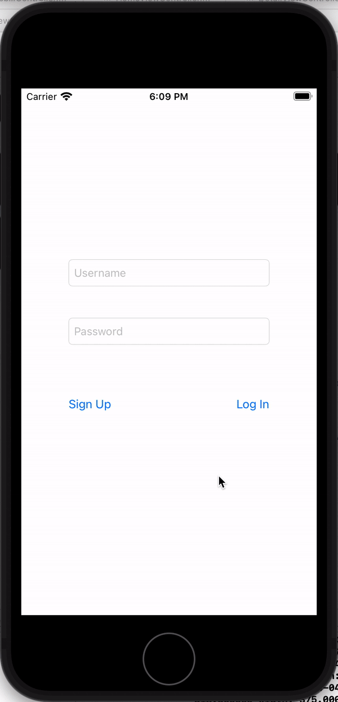

# Dance Social Media App

## Table of Contents
1. [Overview](#Overview)
2. [Product Spec](#Product-Spec)
3. [Wireframes](#Wireframes)
4. [Schema](#Schema)
5. [Complex/Ambiguous Features](#Complex/Ambiguous-Features)
6. [Progress Gifs](#Progress-Gifs)

## Overview
### Description
This app allows dancers and non-dancers alike to post dance videos of themselves and see other people's dance videos.

### App Evaluation
[Evaluation of your app across the following attributes]
- **Category:** Social
- **Mobile:** Dance videos are often filmed on mobile devices and this app will make it easy to upload videos straight from a phone. Browsing dance videos will be convenient on a phone.
- **Story:** Allows users to share dance videos and explore dance videos from others.
- **Market:** Dancers are the primary market for this app, but non-dancers can make an account just to watch dance videos.
- **Habit:** Users can post videos multiple times per day, but it's also possible to spend a lot of time watching other videos. This app has the potential to be very habit-forming.
- **Scope:** The scope will be very narrow at first (like a bare-bones version of TikTok) but can expand to provide cool features just for dancers, like Spotify API integration.

## Product Spec

### 1. User Stories (Required and Optional)

**Required Must-have Stories**

* Users can post a video to their feed
* Users can create a new account
* Users can log in
* Users can see videos from other users in a feed
* Users can search for other users
* Users can indicate what song is playing in their posts using Spotify API
* Users can navigate to detail screen that displays individual videos, with the option to open the song playing in the video using Spotify

**Optional Nice-to-have Stories**

* Users can follow other users
*  Users can like videos
* Users can comment on videos
* Users can bookmark videos to view later
* Users can view their own profile or the profiles of others, which will have a collection of all dance videos the user has posted
* Users can add tags to their videos and search for videos with the same tags
* Users can switch to an explore page with trending videos
* When viewing a dance video, users can navigate to a tutorial screen which will mirror the video, possibly add counts automatically


### 2. Screen Archetypes

* Login/Registration Screen
   * User can log in or sign up for a new account
* Feed
    * User can view videos from people that they follow
* Detail Screen
    * User can see an individual post with additional details, like caption, link to open song on Spotify
* Creation
    * User can film a video or upload a video they already have
* Search
    * User can search for other users
    * Could combine with Explore page, also search for tags

### 3. Navigation

**Tab Navigation** (Tab to Screen)

* Home
* Search User
* Post Video

**Flow Navigation** (Screen to Screen)

* Login/Registration Screen
    * => Feed
* Feed
    * => Detail Screen
    * => Could navigate to profile of user who posted the video, tutorial screen
* Detail Screen
    * => Feed
* Creation
    * => Feed
* Search
    * => None
    * => Could navigate to profile of searched user, tutorial screen once video is clicked

## Wireframes
[Add picture of your hand sketched wireframes in this section]


### [BONUS] Digital Wireframes & Mockups

### [BONUS] Interactive Prototype

## Schema 
### Models
**Model: Post**
| Property  | Type | Description |
| ------------- | ------------- | --------|
| objectID  | String  |unique id for the user post (default field)|
| author  | Pointer to User  |user who posted the post|
| video | File | the dance video to be posted |
| song | Pointer to Song | object representing song in video |
| createdAt | DateTime | date when post is created (default field) |
| updatedAt | DateTime | date when post is last updated (default field) |
| caption | String | image caption by author |
| likesCount | Number | number of likes on post |
commentsCount | Number | number of comments on post

**Model: Song**
| Property  | Type | Description |
| ------------- | ------------- | --------|
| objectID  | String  |unique id for the user post (default field)|
| createdAt | DateTime | date when post is created (default field) |
| updatedAt | DateTime | date when post is last updated (default field) |
| artist | String | the artist who made the song |
| title | String | the title of the song |
| uri | String | the unique identifier corresponding to the track used in the Spotify API |

**Model: User**

| Property  | Type | Description |
| ------------- | ------------- | --------|
| objectID  | String  |unique id for the user (default field)|
| createdAt | DateTime | date when user is created (default field) |
| updatedAt | DateTime | date when user is last updated (default field) |
| username | String | name associated with that specific user
| password | String | password user enters to get into their account


### Networking
**Login Screen**
* Create/POST: sign up for a new account
    ```objc
    // initialize a user object
    PFUser *newUser = [PFUser user];
    
    // set user properties
    newUser.username = self.loginView.usernameField.text;
    newUser.password = self.loginView.passwordField.text;
    
    // call sign up function on the object
    [newUser signUpInBackgroundWithBlock:^(BOOL succeeded, NSError * error) {
        if (error != nil) {
            NSLog(@"Error: %@", error.localizedDescription);
            [self showErrorMessage:error.localizedDescription];
        } else {
            NSLog(@"User registered successfully");
            
            // manually segue to home feed
            [self performSegueWithIdentifier:@"HomeFeedSegue" sender:nil];
        }
    }];
    ```
* Read/GET: log into existing account
    ```objc
    NSString *username = self.loginView.usernameField.text;
    NSString *password = self.loginView.passwordField.text;

    [PFUser logInWithUsernameInBackground:username password:password block:^(PFUser * user, NSError *  error) {
        if (error != nil) {
            NSLog(@"User log in failed: %@", error.localizedDescription);
            [self showErrorMessage:error.localizedDescription];
        } else {
            NSLog(@"User logged in successfully");

            // manually segue to home feed
            [self performSegueWithIdentifier:@"HomeFeedSegue" sender:nil];
        }
    }];
    ```

**Feed**
* Read/GET: fetch posts for home feed
    ```objc
    // construct PFQuery
    PFQuery *postQuery = [Post query];
    [postQuery orderByDescending:@"createdAt"];
    [postQuery includeKey:@"author"];
    postQuery.limit = 20;

    // fetch data asynchronously
    [postQuery findObjectsInBackgroundWithBlock:^(NSArray<Post *> * _Nullable posts, NSError * _Nullable error) {
        if (posts) {
            // do something with the data fetched
            NSLog(@"Feed successfully loaded");
        }
        else {
            // handle error
            NSLog(@"Error: %@", error.localizedDescription);
        }
    }];
    ```

**Detail Screen**
* None

**Creation**
* Create/POST: make a new post
    ``` objc
    // In Post model file, completion block will handle errors
    Post *newPost = [Post new];
    newPost.video = [PFFile fileWithData:videoData]; // video data will be passed in and turned into a file
    newPost.author = [PFUser currentUser];
    newPost.caption = caption;
    newPost.likeCount = @(0);
    newPost.commentCount = @(0);

    [newPost saveInBackgroundWithBlock: completion];
    ```

**Search**
* Read/GET: fetch users whose usernames match search query
    ```objc
    // construct PFQuery
    PFQuery *userQuery = [User query];
    [userQuery whereKey:@"username" equalTo:searchBar.text];
    userQuery.limit = 20;

    // fetch data asynchronously
    [userQuery findObjectsInBackgroundWithBlock:^(NSArray<Post *> * _Nullable posts, NSError * _Nullable error) {
        if (users) {
            // do something with the data fetched
        }
        else {
            // handle error
            NSLog(@"Error: %@", error.localizedDescription);
        }
    }];
    ```
## Complex/Ambiguous Features
1. Caching videos on device: storing videos that are already fetched from Parse on the device so user does not have to load previously fetched videos
2. Multithreading when fetching videos from Parse backend

## Progress Gifs

**Sprint 1**





